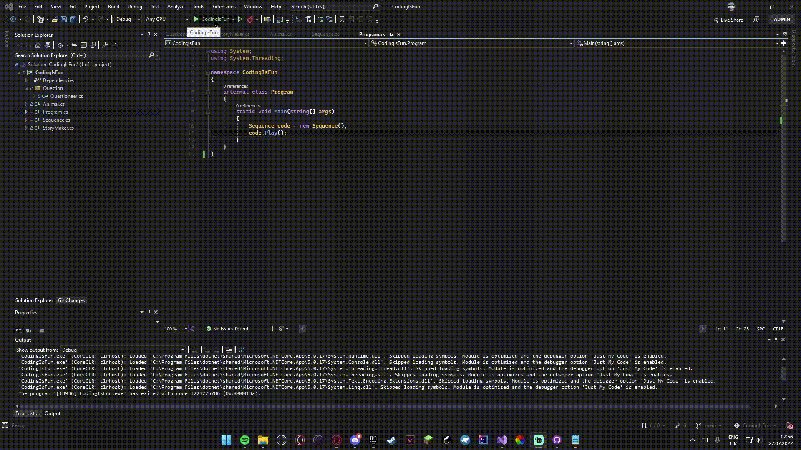

# CodingIsFun
c# Console program that asks questions for an animal and describes it, but console doesnt  allow you to not to answer, YOU HAVE TO
Example of a animal:
  
How its made if u dont trust my code:
